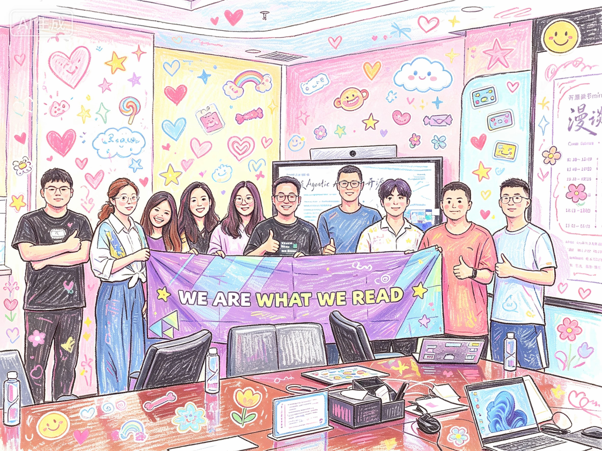

## 开源读书mini沙龙：漫谈 Agentic AI 时代的开源

- 2026.6.27 14:00 ~ 17:00 
- 中国·深圳·福田-上梅林

## 议程 

- 演讲
  - 开源的制度化以及再制度化的可能 BY 适兕 @开源之道
  - Agentic AI 时代的开源：代码、模型与开放数据的交织演进 BY Chris YANG @BayOSS湾区开源驿站
  - 开源硬件当做一本书来读丨从立创开源看“知识共享×动手造物”的新范式  BY 陈贵彬  @立创开源
- 快闪分享 & 深入探讨交流 

## 加入活动群组
https://ibb.co/vnMrLsK （WeChat扫码）【已失效】

## Co-Host BY
- BayOSS湾区开源驿站 
- 开源之书·共读
- 开源之法与经济

## 场地支持
- vivo 开源

## 赞助
- 王厚、振华·开源之道

## 活动回顾

